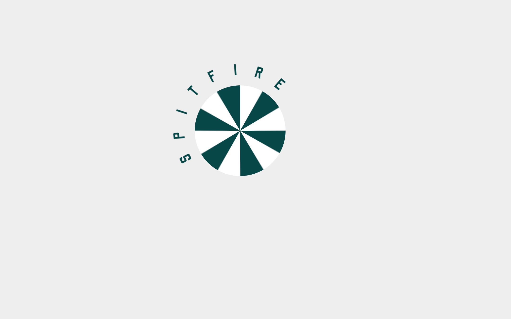
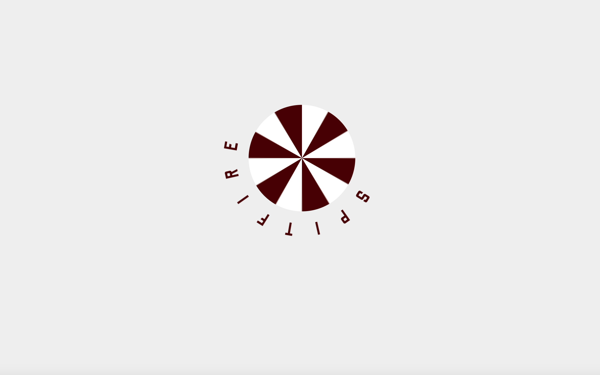

# Procesverslag
**Auteur:** Menno Vlaming

**De opdrachten:** [opdracht 1](opdracht1/index.html) en [opdracht 2](opdracht2/index.html)

Markdown is een simpele manier om HTML te schrijven.  
Markdown cheat cheet: [Hulp bij het schrijven van Markdown](https://github.com/adam-p/markdown-here/wiki/Markdown-Cheatsheet).

Nb. De standaardstructuur en de spartaanse opmaak van de README.md zijn helemaal prima. Het gaat om de inhoud van je procesverslag. Besteedt de tijd voor pracht en praal aan je website.

Nb. Door *open* toe te voegen aan een *details* element kun je deze standaard open zetten. Fijn om dat steeds voor de relevante stuk(ken) te doen.

## Bronnenlijst
  1. https://developer.mozilla.org/en-US/docs/Web/CSS/CSS_Animations/Using_CSS_animations
  2. https://css-tricks.com/almanac/properties/a/animation/
  3. https://www.youtube.com/watch?v=5U21Fk3v8ok

## Opdracht 1 plan

  
uitwerken na schetsen idee (voor week 2)

  ### Je storyboard:
  

  ### Je ambitie: 
  Aan deze technieken/punten wil ik werken:
  - leren van keyframes
  - gebruiken van minder standaard CSS 
  - leren animeren zonder Javascript
 

## Opdracht 1 reflectie

  
Hier een beschrijving van opdracht 1. 
  Voor opdracht 1 heb ik een animatie gemaakt voor het merk 'Spitfire'. 
  Dit is een merk die voornamelijk skateboard wielen verkoopt, 
  en om deze reden is de animatie die ik ga maken het laten draaien van het logo (als een wiel).

  ### Je uitkomst - karakteristiek screenshot(s):
  

  ### Dit ging goed/Heb ik geleerd: 
  Wat ik heb geleerd, is het gebruik maken van een ::after atribute, hiermee heb ik de cirkel gemaakt.

  Wat ik ook heb geleerd is het animeren doormiddel van alleen CSS, het gebruik van keyframes en animations, 
  en het gebruik van font-face voor fonts, dit had ik alle 3 nog nooit gedaan.

  Ook heb ik nog nooit eerder gebruik gemaakt van CSS variabelen en de dark mode optie gebruikt voor andere styling.

  

  ### Dit was lastig/Is niet gelukt:
  Wat ik nog toe had willen voegen, dat helaas niet gelukt is, is dat ik de ::after, dus het 'wiel', wou laten
  draaien om zo nog meer het draaiende wiel effect te geven.

## Opdracht 2 plan

  
uitwerken na schetsen idee (voor week 5)

  ### Je ontwerp:
  

  ### Je ambitie: 
  Aan deze technieken/punten wil ik werken:
  - punt 1
  - punt 2
  - nog een punt
  - ...

## Opdracht 2 test

  
uitwerken na testen (week 7)

  Neem minimaal 5 bevindingen op:

  ### Bevinding 1:
  Omschrijving van wat er nog niet orde was (tekst en afbeeding(en)).

  #### oplossing:
  Beschrijving hoe je het hebt hebt opgelost of als het niet gelukt is hoe je het zou oplossen (tekst en afbeeding(en)).

  ### Bevinding 2:
  Omschrijving van wat er nog niet orde was (tekst en afbeeding(en)).

  #### oplossing:
  Beschrijving hoe je het hebt hebt opgelost of als het niet gelukt is hoe je het zou oplossen (tekst en afbeeding(en)).

  ### Bevinding 3:
  ...

## Opdracht 2 reflectie

  
uitwerken bij afronden opdracht (voor week 8)

  ### Je uitkomst - karakteristiek screenshot(s):
  

  ### Dit ging goed/Heb ik geleerd: 
  Korte omschrijving met plaatje(s)

  

  ### Dit was lastig/Is niet gelukt:
  Korte omschrijving met plaatje(s)

  

