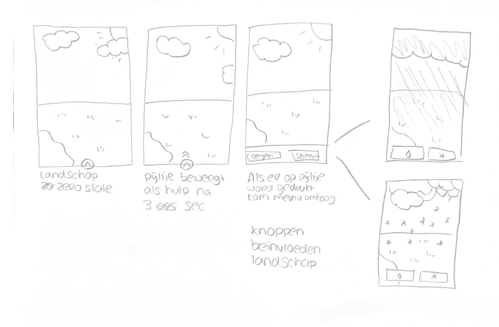
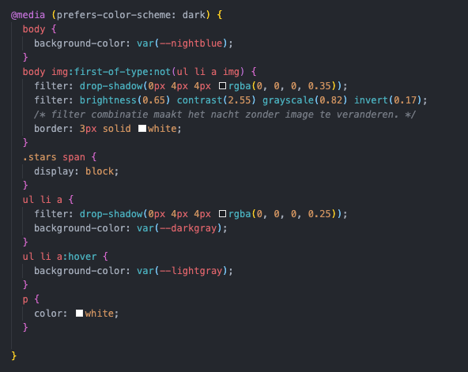
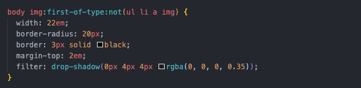
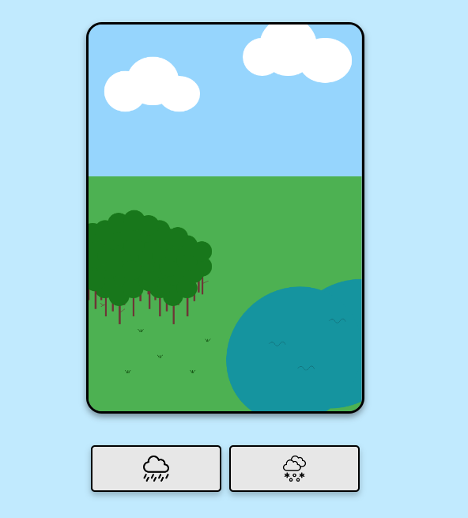
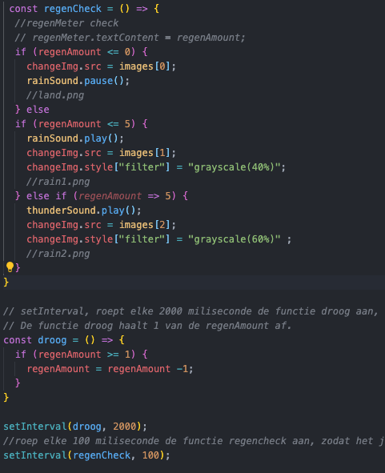
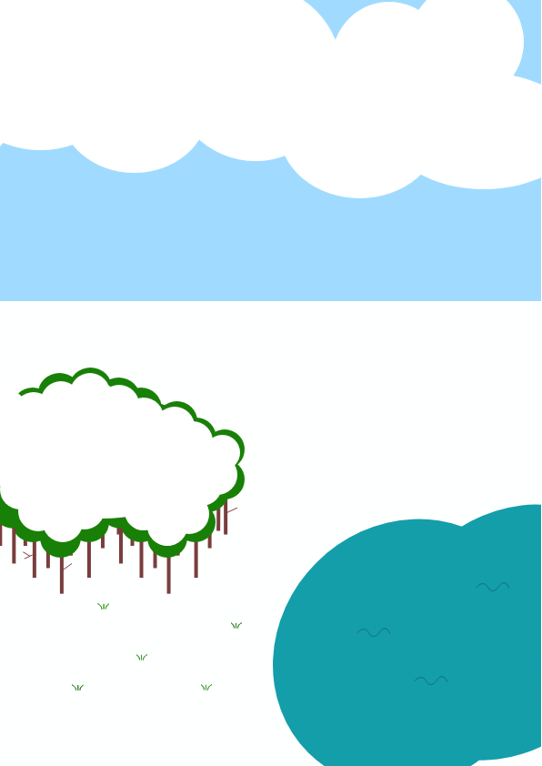

# Procesverslag
**Auteur:** Menno Vlaming

**De opdrachten:** [opdracht 1](opdracht1/index.html) en [opdracht 2](opdracht2/index.html)

Markdown is een simpele manier om HTML te schrijven.  
Markdown cheat cheet: [Hulp bij het schrijven van Markdown](https://github.com/adam-p/markdown-here/wiki/Markdown-Cheatsheet).

Nb. De standaardstructuur en de spartaanse opmaak van de README.md zijn helemaal prima. Het gaat om de inhoud van je procesverslag. Besteedt de tijd voor pracht en praal aan je website.

Nb. Door *open* toe te voegen aan een *details* element kun je deze standaard open zetten. Fijn om dat steeds voor de relevante stuk(ken) te doen.

## Bronnenlijst
  1. https://developer.mozilla.org/en-US/docs/Web/CSS/CSS_Animations/Using_CSS_animations
  2. https://css-tricks.com/almanac/properties/a/animation/
  3. https://www.youtube.com/watch?v=5U21Fk3v8ok

## Opdracht 1 plan

  
uitwerken na schetsen idee (voor week 2)

  ### Je storyboard:
  

  ### Je ambitie: 
  Aan deze technieken/punten wil ik werken:
  - leren van keyframes
  - gebruiken van minder standaard CSS 
  - leren animeren zonder Javascript
 

## Opdracht 1 reflectie

  
Hier een beschrijving van opdracht 1. 
  Voor opdracht 1 heb ik een animatie gemaakt voor het merk 'Spitfire'. 
  Dit is een merk die voornamelijk skateboard wielen verkoopt, 
  en om deze reden is de animatie die ik ga maken het laten draaien van het logo (als een wiel).

  ### Je uitkomst - karakteristiek screenshot(s):
  

  ### Dit ging goed/Heb ik geleerd: 
  Wat ik heb geleerd, is het gebruik maken van een ::after atribute, hiermee heb ik de cirkel gemaakt.

  Wat ik ook heb geleerd is het animeren doormiddel van alleen CSS, het gebruik van keyframes en animations, 
  en het gebruik van font-face voor fonts, dit had ik alle 3 nog nooit gedaan.

  Ook heb ik nog nooit eerder gebruik gemaakt van CSS variabelen en de dark mode optie gebruikt voor andere styling.

  

  ### Dit was lastig/Is niet gelukt:
  Wat ik nog toe had willen voegen, dat helaas niet gelukt is, is dat ik de ::after, dus het 'wiel', wou laten
  draaien om zo nog meer het draaiende wiel effect te geven.

## Opdracht 2 plan

  
Hier een beschrijving van opdracht 2.
  Voor opdracht 2 wil ik een interactief landschap maken, waar een gebruiker invloed heeft op hoe het eruit ziet.
  Een gebruiker kan doormiddel van knoppen weertypes toevoegen aan het landschap, en zo het landschap beinvloeden. 

  ### Je ontwerp:
  

  ### Je ambitie: 
  Aan deze technieken/punten wil ik werken:
  - Met javascript images veranderen (DOM manipulatie).
  - Met javascript css klassen toevoegen. 
  - CSS filters gebruiken/ animaties maken

## Opdracht 2 test

  
Testresultaten week 7

  Ik heb tijdens het testen 5 bevindingen gevonden waar nog aan gewerkt moet worden. 

  ### Bevinding 1:
  De styling van het product was nog niet in orde, er was nog niet genoeg gedaan aan styling omdat ik eerst de functionaliteiten in orde wou hebben.

  #### oplossing:
  Ik ga na het helemaal uitwerken van de functies, de CSS maken. Tot nu toe was alleen de styling uitgewerkt die noodzakelijk was voor de functies.

  ### Bevinding 2:
  Er ontbreekt nog een nachtmodus waar de CSS anders is als de gebruiker zijn laptop in dark mode staat.

  #### oplossing:
  Dit was ik vergeten te doen, na aanleiding hiervan heb ik een dark modus gemaakt.
  
  

  
  ### Bevinding 3:  
  Tijdens het testen kwam ik erachter dat de styling van de images ook op de images van de button gaat, dit is niet de bedoeling en ziet er slordig uit. 

  #### oplossing:
  Dit is opgelost met het gebruiken van een :not selector, hier zorg je ervoor dat hij een specifiek element niet meeneemt in de styling. 
  

## Opdracht 2 reflectie

  
Reflectie week 8

  ### Je uitkomst - karakteristiek screenshot(s):
  
  

  ### Dit ging goed/Heb ik geleerd: 
  Wat ik vooral heb geleerd is hoe ik met Javascript een timer gebruik om waardes te controleren en vervolgens met een if else functie te runnen. 

  

 ### Dit was lastig/Is niet gelukt:
  Wat ik graag nog toe had willen voegen, is dat het landschap (de img) ook veranderd bij de sneeuwfunctie, dit is helaas niet gelukt omdat de  functie hierboven constant aan het switchen is tussen de regenplaatjes.

  Ook had ik misschien de regenplaatjes willen vervangen voor CSS effecten waardoor ik geen plaatjes hoef te gebruiken.
  Ik vond het een leuke uitdaging om te doen met Javascript, maar ik denk dat het resultaat mooier was geweest als ik alleen maar CSS had gebruikt. 

  
  
  

